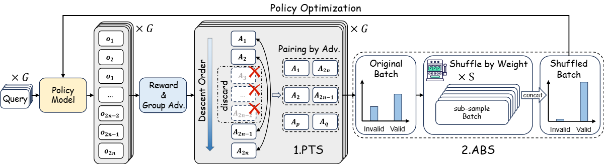

<div align="center">

# Shuffle-R1: Efficient RL framework for Multimodal Large Language Models via Data-centric Dynamic Shuffle

[](https://arxiv.org/abs/2508.05612) 
[](https://arxiv.org/abs/2508.05612) 
[](https://arxiv.org/abs/2508.05612)

</div>

Official code repository of **Shuffle-R1**.
**Project website**: [https://xenozlh.github.io/Shuffle-R1/](https://xenozlh.github.io/Shuffle-R1/)

## Introduction
Shuffle-R1 is a simple yet principled framework that improves RL fine-tuning efficiency by dynamically restructuring trajectory sampling and batch composition. It introduces two key modules:

- **Pairwise Trajectory Sampling (PTS)**
- **Advantage-based Batch Shuffle (ABS)**

Experiments across multiple reasoning benchmarks demonstrate that our framework consistently outperforms strong RL baselines with minimal computational overhead. Specifically, Shuffle-R1 achieves superior performance against GRPO while using only half of the training steps under same settings.

**TL;DR:** We propose Shuffle-R1, a simple and effective RL post-training framework for MLLM that significantly improves RL training efficiency and model performance.

## Release
 - [x] model checkpoints (3B and 7B)
 - [x] datasets
 - [x] training scripts
 - [x] inference scripts via Transformers and vLLM
 - [x] evaluation scripts


## Framework Overview


## Performance Overview
| Model | MathVerse | MathVision | MathVista (mini) | WeMath (loose) | HallusionBench | ChartQA | Avg. |
| :---: | :---: | :---: | :---: | :---: | :---: | :---: | :---: |
| Qwen2.5-VL-3B | 34.8 | 21.9 | 58.4 | 51.7 | 59.8 | 73.1 | 49.9 |
| Qwen2.5-VL-7B | 42.6 | 25.8 | 67.4 | 63.5 | 65.2 | 79.8 | 57.4 |
| Shuffle-R1-3B | 44.2 | 26.8 | 70.4 | 66.5 | 69.2 | 79.9 | 59.5 |
| Shuffle-R1-7B | 53.9 | 30.0 | 77.0 | 72.3 | 71.0 | 84.1 | 64.7 |

All models are evaluated under CoT prompt.

## Try our model

### Using Transformers
The process is the same as [Qwen2.5-VL](https://github.com/QwenLM/Qwen2.5-VL). Note that it is better to add a "Thinking prompt." at the begining of user query.

```
from transformers import Qwen2_5_VLForConditionalGeneration, AutoProcessor
from qwen_vl_utils import process_vision_info

model_path = "path/to/your/checkpoint"

model = Qwen2_5_VLForConditionalGeneration.from_pretrained(
    model_path,
    torch_dtype=torch.bfloat16,
    attn_implementation="flash_attention_2",
    device_map="auto",
)

processor = AutoProcessor.from_pretrained(model_path)

system_prompt = """
You FIRST think about the reasoning process as an internal monologue and then provide the final answer. The reasoning process MUST BE enclosed within <think> </think> tags. The final answer MUST BE put in \\boxed{}.
"""

messages = [
    {
        "role": "user",
        "content": [
            {"type": "image", "image": "path/to/your/image"},
            {"type": "text", "text": system_prompt + "YOUR TEXT QUERY HERE"},
        ],
    }
]

text = processor.apply_chat_template(
    messages, tokenize=False, add_generation_prompt=True
)
image_inputs, video_inputs = process_vision_info(messages)
inputs = processor(
    text=[text],
    images=image_inputs,
    videos=video_inputs,
    padding=True,
    return_tensors="pt",
)
inputs = inputs.to(model.device)

generated_ids = model.generate(**inputs, max_new_tokens=128)
generated_ids_trimmed = [
    out_ids[len(in_ids) :] for in_ids, out_ids in zip(inputs.input_ids, generated_ids)
]
output_text = processor.batch_decode(
    generated_ids_trimmed, skip_special_tokens=True, clean_up_tokenization_spaces=False
)
print(output_text)
```

### Using vLLM
We also provide scripts for vLLM inference. You can run the following command to inference with vLLM:
```
python inference/infer_vllm.py \
    --model path/to/your/checkpoint \
    --output-dir path/to/save/outputs \
    --input-file path/to/your/input/file.jsonl \
    --tensor-parallel-size 1 \
    --min-pixels 262144 \
    --max-pixels 4194304 \
    --max-model-len 8192 \
    --temperature 0.5
```
The inference scripts support batch inference. You can organize your inference data in a jsonl file like this:
```
[
    {'image_path': "path/to/image/1", 'question': "question 1"},
    {'image_path': "path/to/image/2", 'question': "question 2"},
    ...
] 
```


## Install
Our code is based on [EasyR1](https://github.com/hiyouga/EasyR1). Our code follows a non-intrusive design, which keeps the original functions of EasyR1 unchanged. 

For environment installation, you can: 
 - Refer to [**official instructions**](https://verl.readthedocs.io/en/latest/start/install.html).
 - Or using the [**Dockerfile**](Dockerfile) to build the environment.
 - Or directly using the [**pre-built docker image**](https://hub.docker.com/r/hiyouga/verl).


## Training
### Dataset Preparation

### Custom Dataset Format
Supported dataset format is the same as EasyR1. Refer to [**here**](https://github.com/hiyouga/EasyR1?tab=readme-ov-file#custom-dataset) for more information.

### Training Script
```
bash examples/qwen2_5_vl_3b.sh  # 3B model training 
bash examples/qwen2_5_vl_7b.sh  # 7B model training
```

## Evaluation
```
cd evaluation
bash eval.sh  # start evaluation
```
Refer to `evaluation/eval.sh` for more details.


## Acknowledgement
Our work benefit from the following open-source projects:
- [Qwen2.5](https://github.com/QwenLM/Qwen2.5)
- [EasyR1](https://github.com/hiyouga/EasyR1)
- [MM-EUREKA](https://github.com/ModalMinds/MM-EUREKA)
- [NoisyRollout](https://github.com/NUS-TRAIL/NoisyRollout)

## Citation
If you find our work useful for your research, please consider citing:
```
@misc{zhu2025shuffler1,
      title={Shuffle-R1: Efficient RL framework for Multimodal Large Language Models via Data-centric Dynamic Shuffle}, 
      author={Linghao Zhu, Yiran Guan, Dingkang Liang, Jianzhong Ju, Zhenbo Luo, Bin Qin, Jian Luan, Yuliang Liu, Xiang Bai},
      year={2025},
      eprint={2508.05612},
      archivePrefix={arXiv},
      primaryClass={cs.LG},
      url={https://arxiv.org/abs/2508.05612}, 
}
```